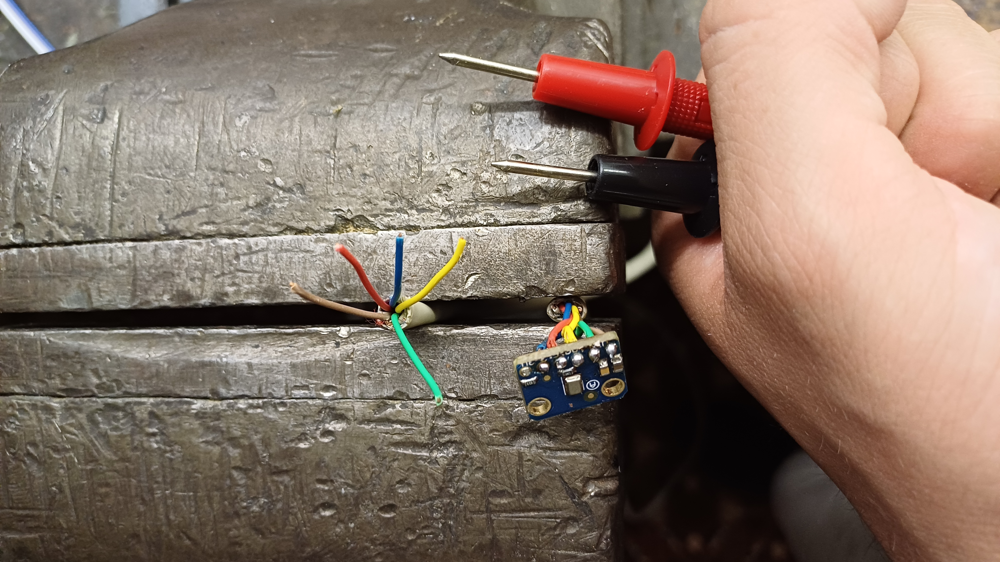
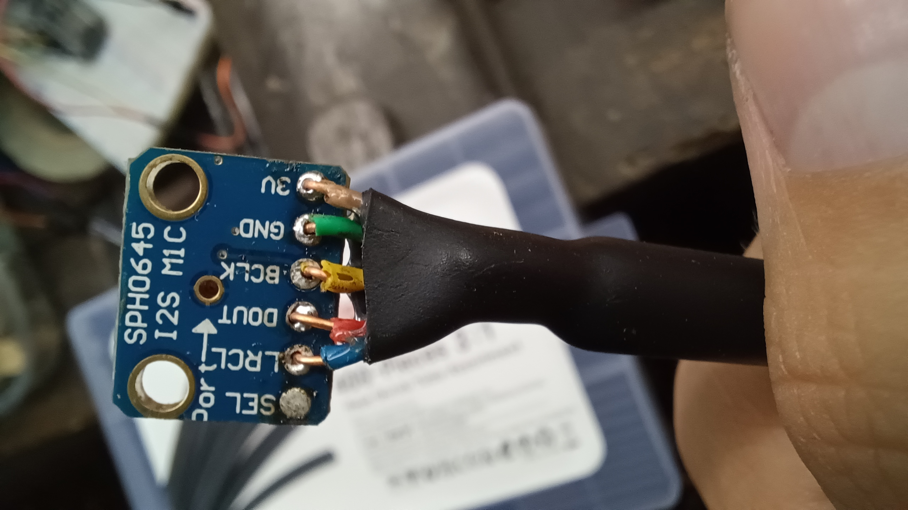

#  Audiobox XL

Audiobox XL is a music-reactive LED box with Spotify integration. It was built and designed by [Koji Gardiner](https://github.com/kojigardiner/).<br>
In this repository, I want to document my changes and progress as I build my own personal version of Audiobox. If you want to know more about Audiobox in general, check out [Koji's repository](https://github.com/kojigardiner/audiobox).

## Table of Contents

1. [My hardware](#hardware)
2. [Changes to the code](#code)
3. [New Features](#features)
4. [Build progress](#build)

## Hardware

For this project, I ordered some items from amazon.
| [ESP-WROOM-32](https://www.amazon.de/dp/B0CLGVXWWN) | [WS2812B 16x16 matrix](https://www.amazon.de/dp/B09X1RYJV8) | [SG90 Mini Servo](https://www.amazon.de/dp/B07MY2Y253) | [SPH0645 I2S interface microphone](https://www.amazon.de/dp/B09B3KYJ2K) | Total |
| ------------- | ------------- | ------------- | ------------- | --- |
| [](./images/components/esp32.jpg) | [](./images/components/matrix.jpg) | [](./images/components/servo.jpg) | [](./images/components/microphone.jpg) |
| 3× | 1× | 4× | 1× |
| 14.99€ | 21.99€ | 9.99€ | 12.17€ | 59.14€ |
| 16.54$ | 24.27$ | 11.03$ | 13.43$ | 65.27$ |

<sub>These values reflect the money I paid in euro and dollar, not the current prices on Amazon.</sub>

Some things I needed I had already laying around from other projects.

| 830 pin breadboard                                                                                                                                                                           | Jumper wires                                                                                                                                                                           | Breadboard bridges                                                                                                                                                                          | LEDs                                                                                                                                                                                      | RJ45 ethernet cable                                                                                                                                                                                 |
| -------------------------------------------------------------------------------------------------------------------------------------------------------------------------------------------- | -------------------------------------------------------------------------------------------------------------------------------------------------------------------------------------- | ------------------------------------------------------------------------------------------------------------------------------------------------------------------------------------------- | ----------------------------------------------------------------------------------------------------------------------------------------------------------------------------------------- | --------------------------------------------------------------------------------------------------------------------------------------------------------------------------------------------------- |
| [](./images/components//breadboard.jpg) | [](./images/components/jumpers.jpg) | [](./images/components/bridges.jpg) | [](./images/components/leds.jpg) | [](./images/components/ethernet.jpg) |
| 2×                                                                                                                                                                                           |                                                                                                                                                                                        |                                                                                                                                                                                             | 2×                                                                                                                                                                                        | 1×                                                                                                                                                                                                  |

## Code

Pretty much all changes I made to the original code are `print()` calls.

In **`platformio.ini`** I had to specify the platform to the specific version `espressif32@3.5.0` since the code wouldn't build otherwise. I added `ArduinoSort.zip` to the project and required it via a relative path. The last thing I did was to specify `board_build.filesystem = spiffs`.

In **`AudioProcessor.cpp`**,

```cpp
i2s_config_t i2s_config = {
    .communication_format = I2S_COMM_FORMAT_I2S | I2S_COMM_FORMAT_I2S_MSB
};
```

was marked as deprecated. So I replaced it:

```cpp
i2s_config_t i2s_config = {
    .communication_format = i2s_comm_format_t(I2S_COMM_FORMAT_I2S | I2S_COMM_FORMAT_I2S_MSB)
};
```

Since `SPOTIFY_REDIRECT_URI` in **`Spotify.h`** is hardcoded to a specific IP, I changed it to match my ESP's IP. After audiobox is authorized to access your Spotify account, this value becomes obsolete.

In **`WebServer.cpp`** I replaced a `switch` statement by `if else if`, because my ESP somehow interpreted integers als boolean values in the switch statement.

In **`main.cpp`** I had to change some button logic, since the built-in buttons on my ESP are `HIGH` by default.

### ⚠ This is important if you plan to run Audiobox on your ESP!

The weirdest thing I encountered was that the default stack size of `8192` bytes wasn't enough to run the spotify authorization. So I naturally just went to `C:\Users\%USERNAME%\.platformio\packages\framework-arduinoespressif32@3.10006.210326\tools\sdk\include\config\sdkconfig.h` and changed line `175` to

```h
#define CONFIG_ARDUINO_LOOP_STACK_SIZE 8192 * 4
```

Another difficulty I had was the filesystem. I didn't work with platformio before, so I didn't know how to upload the data to my ESP. Luckily, I found a [detailed guide](https://randomnerdtutorials.com/esp32-vs-code-platformio-spiffs/) that helped me to manage that.

## Features

Right now, I haven't added any new features. But I've planned a few.

## Build

The first thing I did was to put my ESP on two breadboards and connect everything.

<div style="max-width:500px;">
     
    The breadboard with all the components on it from above
</div>
<br>
<div style="max-width:500px;">
     
    The 16x16 led matrix
</div>
<br>
<div style="max-width:500px;">
     
    🔵 VCC 🟤 DIN 🟢 GND
</div>
<br>
<div style="max-width:500px;">
     
    🟠 VCC 🟡 PWM 🔴 GND
</div>
<br>
<div style="max-width:500px;">
     
    I connected the microphone via five jumper wires for testing
</div>
<br>
<div style="max-width:500px;">
     
    I soldered a ethernet cable (2m or 6.6ft) to the microphone and tested the connectivity. 🟢 GND 🟡 BLCK LRCL 🔴 DOUT 🟤 VCC
    <br>Connecting SEL isn't nesseccary, because we listen only on the left channel. (I know this is bad practice)
</div>
<br>
<div style="max-width:500px;">
     
    To To reinforce and protect the inner cables, I put a heat shrink tube between the microphone and the outer cable
</div>
<br>
<div style="max-width:500px;">
     
    This is the microphone and cable right now
</div>
<br>

<figcaption>Matrix vs album cover (Coldplay - A Head Full of Dreams)</figcaption>
<div style="display:flex; gap:10px">


</div>
